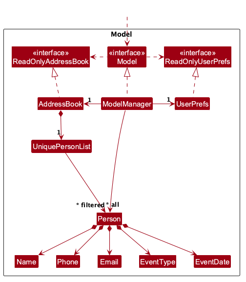
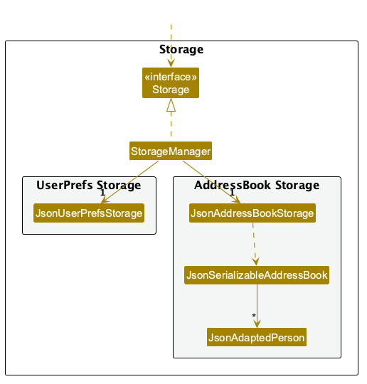

* Table of Contents
{:toc}

--------------------------------------------------------------------------------------------------------------------

## **Acknowledgements**

* _{List the sources of reused or adapted ideas, code, documentation, and third-party libraries here, with links to the originals.}_

--------------------------------------------------------------------------------------------------------------------

## **Setting up, getting started**

Refer to the guide [_Setting up and getting started_](SettingUp.md).

--------------------------------------------------------------------------------------------------------------------

## **Design**

:bulb: **Tip:** The `.puml` files used to create diagrams are in `docs/diagrams`. Refer to the [_PlantUML Tutorial_ at se-edu/guides](https://se-education.org/guides/tutorials/plantUml.html) to learn how to create and edit diagrams.

### Architecture

The ***Architecture Diagram*** given above explains the high-level design of the App.

The following provides a quick overview of the main components and their interactions.

**Main components of the architecture**

**`Main`** (consisting of classes [`Main`](https://github.com/se-edu/addressbook-level3/tree/master/src/main/java/seedu/address/Main.java) and [`MainApp`](https://github.com/se-edu/addressbook-level3/tree/master/src/main/java/seedu/address/MainApp.java)) is in charge of the app launch and shut down.
* At app launch, it initializes the other components in the correct sequence, and connects them up with each other.
* At shut down, it shuts down the other components and invokes cleanup methods where necessary.

The bulk of the app's work is done by the following four components:

* [**`UI`**](#ui-component): The UI of the App.
* [**`Logic`**](#logic-component): The command executor.
* [**`Model`**](#model-component): Holds the data of the App in memory.
* [**`Storage`**](#storage-component): Reads data from, and writes data to, the hard disk.

[**`Commons`**](#common-classes) represents a collection of classes used by multiple other components.

**How the architecture components interact with each other**

The *Sequence Diagram* below shows how the components interact with each other for the scenario where the user issues the command `delete 1`.

Each of the four main components (also shown in the diagram above),

* defines its *API* in an `interface` with the same name as the Component.
* provides its functionality through a concrete `{Component Name}Manager` class that implements the corresponding API interface.

For example, the `Logic` component defines its API in `Logic.java` and implements it in `LogicManager.java`. Other components interact with a component through its interface rather than its concrete class, preventing them from coupling to that component's implementation, as illustrated in the following partial class diagram.

The sections below give more details of each component.

### UI component

The **API** of this component is specified in [`Ui.java`](https://github.com/se-edu/addressbook-level3/tree/master/src/main/java/seedu/address/ui/Ui.java)

The UI consists of a `MainWindow` and its parts, such as `CommandBox`, `ResultDisplay`, `PersonListPanel`, and `StatusBarFooter`. All of these, including `MainWindow`, inherit from the abstract `UiPart` class, which captures common behavior among classes that represent visible GUI parts.

The `UI` component uses the JavaFX UI framework. The layouts of these UI parts are defined in matching `.fxml` files in `src/main/resources/view`. For example, [`MainWindow.fxml`](https://github.com/se-edu/addressbook-level3/tree/master/src/main/resources/view/MainWindow.fxml) specifies the layout of [`MainWindow`](https://github.com/se-edu/addressbook-level3/tree/master/src/main/java/seedu/address/ui/MainWindow.java).

The `UI` component,

* executes user commands using the `Logic` component.
* listens for changes to `Model` data so that the UI can be updated with the modified data.
* keeps a reference to the `Logic` component, because the `UI` relies on the `Logic` to execute commands.
* depends on some classes in the `Model` component because it displays `Person` objects from the model.

### Logic component

**API** : [`Logic.java`](https://github.com/se-edu/addressbook-level3/tree/master/src/main/java/seedu/address/logic/Logic.java)

Here's a (partial) class diagram of the `Logic` component:

The sequence diagram below illustrates the interactions within the `Logic` component, taking `execute("delete 1")` API call as an example.

:information_source: **Note:** The lifeline for `DeleteCommandParser` should end at the destroy marker (X), but due to a limitation of PlantUML, it continues to the end of the diagram.

How the `Logic` component works:

1. When `Logic` is called upon to execute a command, the command is passed to an `AddressBookParser` object, which in turn creates a parser that matches the command (e.g., `DeleteCommandParser`) and uses it to parse the command.
1. This results in a `Command` object (more precisely, an object of one of its subclasses e.g., `DeleteCommand`) which is executed by the `LogicManager`.
1. The command can communicate with the `Model` when it is executed (e.g. to delete a person). 
   Note that although this is shown as a single step in the diagram above for simplicity, the code can require several interactions between the command object and the `Model` to complete the operation.
1. The result of the command execution is encapsulated as a `CommandResult` object which is returned from `Logic`.

Here are the other classes in `Logic` (omitted from the class diagram above) that are used for parsing a user command:

How the parsing works:
* When called upon to parse a user command, the `AddressBookParser` class creates an `XYZCommandParser` (`XYZ` is a placeholder for the specific command name, e.g., `AddCommandParser`). The parser uses the other classes shown above to parse the user command and create an `XYZCommand` object (e.g., `AddCommand`). The `AddressBookParser` returns that object as a `Command` object.
* All `XYZCommandParser` classes, such as `AddCommandParser` and `DeleteCommandParser`, implement the `Parser` interface so they can be treated similarly where appropriate, for example during testing.

### Model component
**API** : [`Model.java`](https://github.com/se-edu/addressbook-level3/tree/master/src/main/java/seedu/address/model/Model.java)

The `Model` component,

* stores the address book data i.e., all `Person` objects (which are contained in a `UniquePersonList` object).
* represents each `Person` as one photography engagement containing a client's `Name`, `Phone`, `Email`,
  `EventType`, and `EventDate`.
* stores the `Person` objects selected by the current filter, such as search results, in a separate _filtered_ list. It exposes this list as an unmodifiable `ObservableList<Person>` that the UI can observe and bind to, so the UI updates when the list changes.
* stores a `UserPrefs` object that represents the user’s preferences (currently, just the GUI settings). This is exposed to the outside as a `ReadOnlyUserPrefs` object.
* does not depend on any of the other three components (as the `Model` represents data entities of the domain, they should make sense on their own without depending on other components)

### Storage component

**API** : [`Storage.java`](https://github.com/se-edu/addressbook-level3/tree/master/src/main/java/seedu/address/storage/Storage.java)

The `Storage` component,
* can save both address book data and user preference data in JSON format, and read them back into corresponding objects.
* is implemented by `StorageManager`, which delegates the actual JSON file access to `JsonAddressBookStorage` and `JsonUserPrefsStorage` (one class per data file).
* converts each `Person` to and from a `JsonAdaptedPerson`, including its event type and ISO-8601 event date.
* depends on some classes in the `Model` component (because the `Storage` component's job is to save/retrieve objects that belong to the `Model`)

### Common classes

Classes used by multiple components are in the `seedu.address.commons` package.

--------------------------------------------------------------------------------------------------------------------

## **Implementation**

This section describes some noteworthy details on how certain features are implemented.

### \[Proposed\] Undo/redo feature

#### Proposed Implementation

The proposed undo/redo mechanism is facilitated by `VersionedAddressBook`. It extends `AddressBook` with an undo/redo history, stored internally as an `addressBookStateList` and `currentStatePointer`. Additionally, it implements the following operations:

* `VersionedAddressBook#commit()` — Saves the current address book state in its history.
* `VersionedAddressBook#undo()` — Restores the previous address book state from its history.
* `VersionedAddressBook#redo()` — Restores a previously undone address book state from its history.

These operations are exposed in the `Model` interface as `Model#commitAddressBook()`, `Model#undoAddressBook()` and `Model#redoAddressBook()` respectively.

Given below is an example usage scenario and how the undo/redo mechanism behaves at each step.

Step 1. The user launches the application for the first time. The `VersionedAddressBook` will be initialized with the initial address book state, and the `currentStatePointer` pointing to that single address book state.

Step 2. The user executes `delete 5` command to delete the 5th person in the address book. The `delete` command calls `Model#commitAddressBook()`, causing the modified state of the address book after the `delete 5` command executes to be saved in the `addressBookStateList`, and the `currentStatePointer` is shifted to the newly inserted address book state.

Step 3. The user executes `add n/David …​` to add a new person. The `add` command also calls `Model#commitAddressBook()`, causing another modified address book state to be saved into the `addressBookStateList`.

:information_source: **Note:** If a command fails its execution, it will not call `Model#commitAddressBook()`, so the address book state will not be saved into the `addressBookStateList`.

Step 4. The user now decides that adding the person was a mistake, and decides to undo that action by executing the `undo` command. The `undo` command will call `Model#undoAddressBook()`, which will shift the `currentStatePointer` once to the left, pointing it to the previous address book state, and restores the address book to that state.

:information_source: **Note:** If the `currentStatePointer` is at index 0, pointing to the initial AddressBook state, then there are no previous AddressBook states to restore. The `undo` command uses `Model#canUndoAddressBook()` to check if this is the case. If so, it will return an error to the user rather
than attempting to perform the undo.

The following sequence diagram shows how an undo operation goes through the `Logic` component:

:information_source: **Note:** The lifeline for `UndoCommand` should end at the destroy marker (X), but due to a limitation of PlantUML, it continues to the end of the diagram.

Similarly, how an undo operation goes through the `Model` component is shown below:

The `redo` command does the opposite — it calls `Model#redoAddressBook()`, which shifts the `currentStatePointer` once to the right, pointing to the previously undone state, and restores the address book to that state.

:information_source: **Note:** If the `currentStatePointer` is at index `addressBookStateList.size() - 1`, pointing to the latest address book state, then there are no undone AddressBook states to restore. The `redo` command uses `Model#canRedoAddressBook()` to check if this is the case. If so, it will return an error to the user rather than attempting to perform the redo.

Step 5. The user then decides to execute the command `list`. Commands that do not modify the address book, such as `list`, will usually not call `Model#commitAddressBook()`, `Model#undoAddressBook()` or `Model#redoAddressBook()`. Thus, the `addressBookStateList` remains unchanged.

Step 6. The user executes `clear`, which calls `Model#commitAddressBook()`. Since the `currentStatePointer` is not pointing at the end of the `addressBookStateList`, all address book states after the `currentStatePointer` will be purged. Reason: It no longer makes sense to redo the `add n/David …​` command. This is the behavior that most modern desktop applications follow.

The following activity diagram summarizes what happens when a user executes a new command:

#### Design considerations:

**Aspect: How undo & redo execute:**

* **Alternative 1 (current choice):** Saves the entire address book.
  * Pros: Easy to implement.
  * Cons: May have performance issues in terms of memory usage.

* **Alternative 2:** Individual command knows how to undo/redo by
  itself.
  * Pros: Will use less memory (e.g. for `delete`, just save the person being deleted).
  * Cons: We must ensure that the implementation of each individual command is correct.

_{more aspects and alternatives to be added}_

### \[Proposed\] Data archiving

_{Explain here how the data archiving feature will be implemented}_

--------------------------------------------------------------------------------------------------------------------

## **Documentation, logging, testing, dev-ops**

* [Documentation guide](Documentation.md)
* [Testing guide](Testing.md)
* [Logging guide](Logging.md)
* [DevOps guide](DevOps.md)

--------------------------------------------------------------------------------------------------------------------

## **Appendix: Requirements**

### Product scope

**Target user profile**:

* is a freelance photographer who handles event-based jobs
* has a need to manage a significant number of clients and photography jobs
* needs to track client contact details, event details, and job progress from enquiry to delivery
* prefers desktop apps over other types of applications
* can type fast
* prefers typing to mouse interactions
* is reasonably comfortable using CLI apps

**Value proposition**: Manage photography clients and jobs from enquiry to delivery faster than with a typical mouse-driven GUI application.

### User stories

Priorities: High (must have) - `* * *`, Medium (nice to have) - `* *`, Low (unlikely to have) - `*`

| Priority | User story |
| -------- | ---------- |
| `***` | As a photographer, I can add a new contact with their name, event type, and event date, so that I have a record of every client I am working with. |
| `***` | As a photographer, I can tag a contact's stage of engagement, such as enquiry, booked, shot completed, awaiting payment, or delivered, so that I always know what needs to happen next. |
| `***` | As a photographer, I can edit a contact's details, so that I can keep information accurate as things change. |
| `***` | As a photographer, I can delete a contact, so that my contact list does not fill up with irrelevant clients. |
| `***` | As a photographer, I can search by phone number or email address, so that I can identify a client even when I do not remember their name. |
| `***` | As a photographer, I can search for clients by event type, so that I can quickly locate clients associated with specific types of shoots. |
| `***` | As a photographer, I can view contacts sorted by upcoming event date, so that I can prioritise the most time-sensitive clients first. |
| `***` | As a photographer, I can filter contacts by engagement stage, so that I can quickly find everyone who requires follow-up. |
| `***` | As a photographer, I can view all contacts with events happening within the next seven days, so that I can prepare logistics in advance. |
| `***` | As a fast typist, I can add, edit, and find contacts by typing commands, so that I can manage clients faster than with a form. |
| `***` | As a photographer, I can type `help` to list all available commands and their syntax, so that I do not need to consult external documentation while using the application. |
| `**` | As a photographer, I can link multiple events to the same repeat client, so that I can see their full history in one place. |
| `**` | As a photographer, I can add free-text notes to a contact, such as the shoot location, package, or special requests, so that I do not lose important context. |
| `**` | As a photographer, I can attach specific event requirements to a client's profile, such as “Needs drone shots”, so that I have all the necessary information before contacting them. |
| `**` | As a photographer, I can record how a client found me, such as through a referral, Instagram, or my website, so that I can track which channels bring in the most business. |
| `*` | As a photographer, I can archive completed contacts, so that my active list stays focused on current work. |
| `*` | As a photographer, I can flag a contact as a possible duplicate when adding one with a similar name or email address, so that I do not accidentally create redundant entries. |

*{More to be added}*

### Use cases

(For all use cases below, the **System** is `ShutterLink` and the **Actor** is the `user`, a freelance event photographer, unless specified otherwise)

**Use case: UC01 - Add a contact**

**MSS**

1.  User requests to add a contact, giving the client's name, phone number, email address, event type and event date.
2.  ShutterLink adds the contact with the stage _Enquiry_ and shows the full contact list.

    Use case ends.

**Extensions**

* 1a. A required detail (name, phone number, email address, event type or event date) is missing, or a given detail is invalid.

    * 1a1. ShutterLink shows an error message describing the first problem found.
    * 1a2. User requests to add the contact again with corrected details.

      Steps 1a1-1a2 are repeated until the details are valid. 
      Use case resumes from step 2.

* 1b. A contact with exactly the same name, phone number, email address, event type and event date already exists.

    * 1b1. ShutterLink informs the user that the contact already exists and does not add it.

      Use case ends.

* 1c. ShutterLink is unable to save the data.

    * 1c1. ShutterLink shows an error message and does not add the contact.

      Use case ends.

**Use case: UC02 - Find contacts by name, contact detail or event type**

**MSS**

1.  User requests to find contacts, giving one name, phone number, email address or event type.
2.  ShutterLink shows all contacts that exactly match the given value.

    Use case ends.

**Extensions**

* 1a. User gives no search value, or more than one.

    * 1a1. ShutterLink shows an error message asking for exactly one search value.

      Use case resumes at step 1.

* 1b. The given value is invalid (e.g., an incomplete email address).

    * 1b1. ShutterLink shows an error message.

      Use case resumes at step 1.

* 2a. No contact matches the given value.

    * 2a1. ShutterLink informs the user that no contacts were found.

      Use case ends.

**Use case: UC03 - Update the engagement stage of a contact**

**MSS**

1.  User requests to list contacts, or finds the relevant contacts (UC02).
2.  ShutterLink shows a list of contacts.
3.  User requests to change the stage of a specific contact in the list to a new stage.
4.  ShutterLink updates the stage of the contact and shows the full contact list.

    Use case ends.

**Extensions**

* 2a. The list is empty.

  Use case ends.

* 3a. The given index is invalid.

    * 3a1. ShutterLink shows an error message.

      Use case resumes at step 2.

* 3b. The given stage is not one of the supported stages.

    * 3b1. ShutterLink shows an error message listing the supported stages.

      Use case resumes at step 2.

* 3c. The contact already has the given stage.

    * 3c1. ShutterLink informs the user that the stage is unchanged and keeps the current list.

      Use case ends.

* 3d. ShutterLink is unable to save the data.

    * 3d1. ShutterLink shows an error message and does not change the stage.

      Use case ends.

**Use case: UC04 - Edit the details of a contact**

**MSS**

1.  User requests to list contacts, or finds the relevant contacts (UC02).
2.  ShutterLink shows a list of contacts.
3.  User requests to edit a specific contact in the list, giving the new values of one or more details.
4.  ShutterLink updates the contact and shows the full contact list.

    Use case ends.

**Extensions**

* 2a. The list is empty.

  Use case ends.

* 3a. The given index is invalid.

    * 3a1. ShutterLink shows an error message.

      Use case resumes at step 2.

* 3b. User does not give any detail to edit, or a given detail is invalid.

    * 3b1. ShutterLink shows an error message and does not change the contact.

      Use case resumes at step 2.

* 3c. The edit would leave any required detail (name, phone number, email address, event type or event date) missing.

    * 3c1. ShutterLink shows an error message and does not change the contact.

      Use case resumes at step 2.

* 3d. The edited contact would be identical to another existing contact.

    * 3d1. ShutterLink informs the user that the edit would create a duplicate and does not change the contact.

      Use case resumes at step 2.

* 3e. All given values are the same as the current details.

    * 3e1. ShutterLink informs the user that no changes were made and keeps the current list.

      Use case ends.

* 3f. ShutterLink is unable to save the data.

    * 3f1. ShutterLink shows an error message and does not change the contact.

      Use case ends.

**Use case: UC05 - Delete a contact**

**MSS**

1.  User requests to list contacts, or finds the relevant contacts (UC02).
2.  ShutterLink shows a list of contacts.
3.  User requests to delete a specific contact in the list.
4.  ShutterLink deletes the contact immediately and shows the remaining contacts.

    Use case ends.

**Extensions**

* 2a. The list is empty.

  Use case ends.

* 3a. The given index is invalid.

    * 3a1. ShutterLink shows an error message.

      Use case resumes at step 2.

* 3b. ShutterLink is unable to save the data.

    * 3b1. ShutterLink shows an error message and keeps the contact.

      Use case ends.

**Use case: UC06 - Follow up on engagements at a stage**

**MSS**

1.  User requests to list the contacts at a specific stage (e.g., _Awaiting Payment_).
2.  ShutterLink shows the contacts at that stage.
3.  User follows up with a client in the list outside ShutterLink.
4.  User updates the stage of that contact (UC03).

    Steps 3-4 are repeated for each client the user follows up with. 
    Use case ends.

**Extensions**

* 1a. The given stage is not one of the supported stages.

    * 1a1. ShutterLink shows an error message listing the supported stages.

      Use case resumes at step 1.

* 2a. No contact is at the given stage.

    * 2a1. ShutterLink informs the user that no contacts were found at that stage.

      Use case ends.

**Use case: UC07 - Prepare for upcoming events**

**MSS**

1.  User requests to view upcoming events.
2.  ShutterLink shows the contacts whose event dates fall within today and the next six days, sorted by event date.
3.  User reviews the events and edits the details of a contact if needed (UC04).

    Use case ends.

**Extensions**

* 1a. ShutterLink is unable to determine today's date.

    * 1a1. ShutterLink shows an error message and keeps the current list.

      Use case ends.

* 2a. No event falls within the next seven days.

    * 2a1. ShutterLink informs the user that no events are scheduled in that period.

      Use case ends.

### Non-Functional Requirements

These requirements describe the intended quality of ShutterLink for an independent freelance event photographer.
They apply to the full product direction, including features introduced after the MVP, where relevant;
they do not assert that every requirement is already implemented.
A **contact record** represents one client engagement for one event, so repeat clients may have multiple records.

1. **Platform compatibility (NFR-01).** ShutterLink shall run on Windows, Linux and macOS with Java 25 installed,
   without requiring another Java version. Supported operations shall have the same behaviour across these platforms.
2. **Portable distribution (NFR-02).** Users shall be able to run ShutterLink from a single downloadable JAR
   without an application installer or separately installed dependencies other than the required Java runtime.
3. **Independent, offline operation (NFR-03).** Client and event management, searching, sorting, filtering,
   upcoming-event views, command help, and saving/loading shall remain available without an Internet connection.
   Normal use shall not require an account, a shared data service, or a remote server.
   Each installation is intended for one photographer managing their own records; concurrent users and shared-file
   collaboration are outside the supported operating environment.
4. **Local data ownership and privacy (NFR-04).** Client records shall be stored locally in a human-editable UTF-8
   text format, without a database server. Valid manual edits made while the application is closed shall be loaded
   on the next launch. Normal operation shall not transmit client records to external services.
   Local files are not encrypted by this requirement; restricting access to the device and files remains the user's
   responsibility. Any future export feature shall retain this local-data model.
5. **Persistence (NFR-05).** After a data-changing command reports success, its changes shall be saved locally
   and restored after a normal shutdown and restart, preserving all supported field values and record order.
   This assumes writable storage with sufficient space and excludes external file modification or disk failure.
6. **Failure safety (NFR-06).** Invalid commands shall leave records, the active filter/sort, and displayed indexes
   unchanged. A failed save shall not be reported as success: the application shall preserve the prior in-memory
   state and last valid saved data, and give an actionable error. A malformed data file shall not be silently
   overwritten with empty or sample data. These guarantees cover validation and ordinary file-I/O failures;
   recovery from physical storage failure is outside scope.
7. **Keyboard usability (NFR-07).** All supported contact-management and query operations shall be available through
   typed commands without mandatory mouse interaction. On success, the command field shall clear and regain focus;
   on rejection, it shall retain the input for correction. Command help shall be accessible from the keyboard.
   This also applies to later contact-management features, such as notes or reminders, if implemented.
8. **Readable feedback and display (NFR-08).** Errors shall include a visible text label as well as colour, so colour
   alone is not needed to distinguish them. Valid long field values shall wrap and remain readable through scrolling.
   At 1920 x 1080 or higher with 100% or 125% scaling, the command input, feedback, and record details shall be usable
   without resolution-related clipping. All functions shall remain accessible at 1280 x 720 or higher with 150%
   scaling, allowing scrolling where necessary.
9. **Capacity and responsiveness (NFR-09, proposed target).** ShutterLink shall support at least 1,000 contact records
   across all engagement stages. With up to this volume, at least 95% of a 100-command test sequence shall complete
   within 2 seconds per command, measured from submission to updated feedback and results, including saving for
   data-changing commands. The sequence shall exercise adding, editing, deleting, stage changes, finding, listing,
   sorting, filtering, and upcoming-event queries with valid data. Measure after application startup on a computer
   with at least two CPU cores, 8 GB RAM, SSD storage and Java 25, without other resource-intensive applications
   running. Record the OS, hardware and dataset with the results. This is a proposed acceptance target for team
   review, not an existing benchmark result.

The platform, distribution, local-storage and display requirements reflect the relevant
[tP product constraints](https://nus-cs2103-ay2627-s1.github.io/website/admin/tp-constraints.html).
Course process requirements, such as incremental delivery, are not product NFRs.

### Glossary

* **Mainstream OS**: Windows, Linux, Unix, or macOS
* **Private contact detail**: A contact detail that is not meant to be shared with others
* **Engagement**: A client relationship record containing contact details and information about a specific event.
* **Engagement stage**: The current progress of an engagement, such as `Enquiry`, `Booked`, or `Awaiting Payment`.
* **Event type**: The category of event associated with an engagement, such as a wedding or birthday celebration.
* **Current displayed list**: The contacts currently visible to the user after applying a search, filter, or sort. Command indexes refer to this list.
* **Upcoming events**: Events scheduled from today through the next six calendar days, inclusive.
* **Exact matching**: A search method that matches the complete normalized value rather than a partial substring.

--------------------------------------------------------------------------------------------------------------------

## **Appendix: Instructions for manual testing**

Given below are instructions to test the app manually.

:information_source: **Note:** These instructions only provide a starting point for testers to work on;
testers are expected to do more *exploratory* testing.

### Launch and shutdown

1. Initial launch

   1. Download the JAR file and copy it into an empty folder.

   1. Double-click the JAR file. 
      Expected: The GUI opens with a set of sample contacts. The window size may not be optimal.

1. Saving window preferences

   1. Resize the window to an optimal size. Move the window to a different location. Close the window.

   1. Relaunch the app by double-clicking the JAR file. 
       Expected: The most recent window size and location are retained.

1. _{ more test cases …​ }_

### Deleting a person

1. Deleting a person while all persons are being shown

   1. Prerequisites: List all persons using the `list` command, with multiple persons in the list.

   1. Test case: `delete 1` 
      Expected: The first contact is deleted from the list. The status message shows the deleted contact's details.

   1. Test case: `delete 0` 
      Expected: No person is deleted. The status message shows error details.

   1. Other incorrect delete commands to try: `delete`, `delete x`, `...` (where x is larger than the list size) 
      Expected: Similar to previous.

1. _{ more test cases …​ }_

### Saving data

1. Dealing with missing/corrupted data files

   1. _{Explain how to simulate missing or corrupted data files and state the expected behavior.}_

1. _{ more test cases …​ }_
